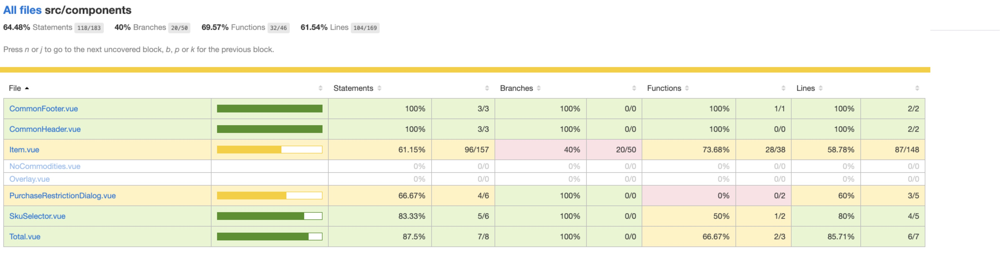

# Vue 练手 仿手淘 H5 购物车

## Screenshot

## Introduction

以前写的一个购物车的练习工程. 数据都是来自手淘的真实数据. 可访问[线上链接](https://shopping-cart.yancey.app)体验.

## Usage

    ### Project setup

    yarn install

    ### Compiles and hot-reloads for development

    yarn run serve

    ### Compiles and minifies for production

    yarn run build

关于测试数据，可以进入`src/assets/mock/data.js`中修改，然后把 console 的数据复制到
`public/data.json`中即可。但是要保证`storeId`和`skuId`的唯一性。

## Features

- 展示购物车数量, 每个商铺的商品, 总价等

- 点击左边的 radio 可以将商品加入到下单计算

- 点击 + 或 - 可以增加或减少数量

- 左滑展示删除按钮, 可以删除商品

- 展示 sku picker

## Tips

电商有两个概念，一个是 SPU(Standard Product Unit)，另一个是 SKU(Stock Keeping Unit)。

其中 SPU 就是一个独立商品，比如 iPhone Xs，比如 MacBook Pro.

而 SKU 是一个独立商品的类型组合单元，拿 iPhone Xs 为例，假设这款手机有两种属性，分别
是`颜色`和`容量存储`，假设有`黑、白、金`三种颜色，`16G 和 64G`两种容量存储，这意味着 iPhone Xs
有六种组合方式，这六种组合方式会有`不同的价格`，不同的`货存量`，变态点儿还有不同的`促销方式`。

## 组件测试

使用 Cypress 进行组件测试.

## License

Shopping-Cart-H5 is [MIT licensed](https://opensource.org/licenses/MIT).
